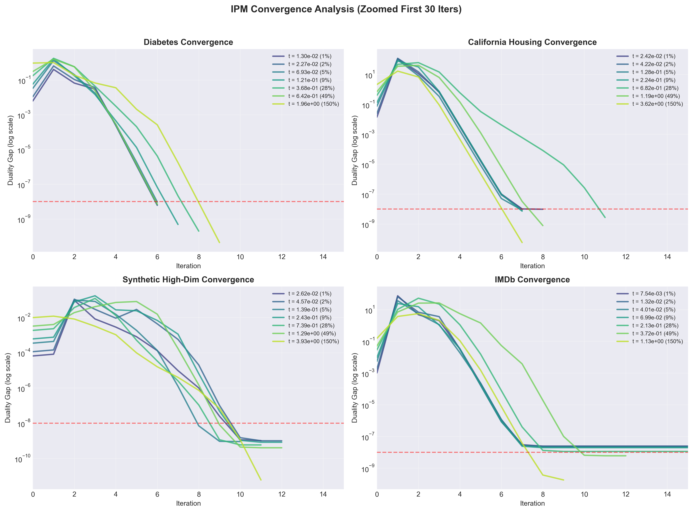
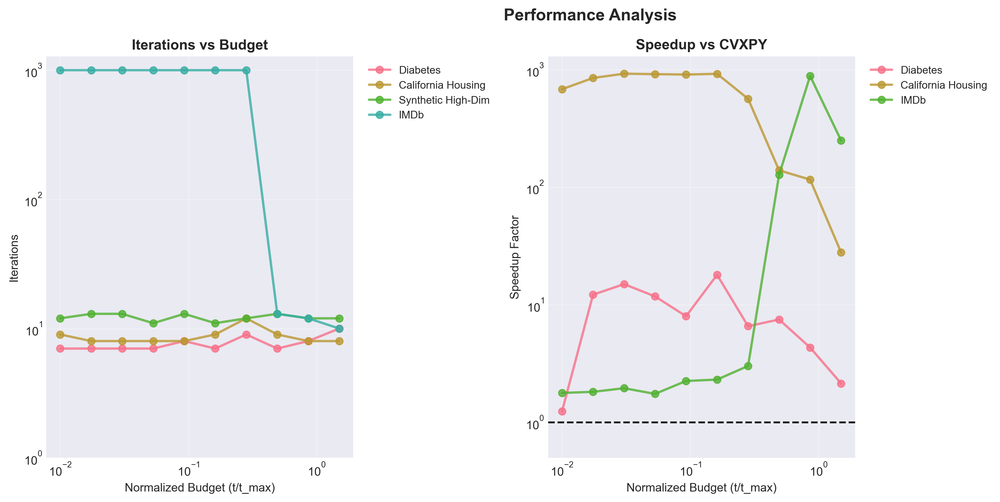

**Author:** Giuseppe Muschetta  
**University:** University of Pisa  
**Degree:** M.Sc. in Data Science & Business Informatics  
**Course:** Optimization for Data Science  
**Instructor:** Prof. Antonio Frangioni  
**Academic year:** 2025–2026  
**Final grade:** 30/30

---

<div align="center">

# Constrained Lasso Optimization

### Mehrotra's Predictor–Corrector Interior-Point Method, from Theory to Implementation


[Read the report](Report/Report.pdf) · [Explore the solver](lasso_ipm_solver.py) · [Explore the experiments](experimental_suite.py)

</div>

---

An end-to-end study of **constrained Lasso**, built around a custom implementation of **Mehrotra's predictor–corrector primal–dual interior-point algorithm**. The project connects convex optimization theory, numerical linear algebra, and experimental benchmarking across four datasets: from the quadratic reformulation and KKT conditions to a solver designed to exploit the problem's structure.

Developed by **Giuseppe Muschetta** for the **master's-level course examination** in *Optimization for Data Science*, as part of the **M.Sc. in Data Science & Business Informatics at the University of Pisa**. The project was evaluated by **Prof. Antonio Frangioni** and awarded **30/30, the maximum grade**.

**Performance highlight:** in the report's 2,000-feature synthetic benchmark, the custom Mehrotra solver reaches the reported solution in **12 outer iterations and 1.6431 seconds**, compared with **73.0054 seconds for SCS through CVXPY**: a **44.4× reported speedup**, with an $\ell_2$ solution distance of $1.16\times10^{-7}$.

## Project highlights

- **Mehrotra's algorithm implemented from scratch:** develops the affine-scaling predictor, second-order corrector, adaptive centering, and primal–dual updates using NumPy and SciPy.
- **Two linear algebra strategies:** Cholesky factorization for smaller systems and preconditioned Conjugate Gradient for larger feature spaces.
- **Numerical stability mechanisms:** adaptive regularization, retry logic, and diagnostics for conditioning, residuals, and complementarity.
- **Experiments across complementary scales:** from 8–10 features to **2,000 features**, including a processed IMDb dataset with **148,432 samples**.
- **Detailed empirical comparison:** benchmarks against OSQP and SCS through CVXPY, with scikit-learn Lasso as the reference for aligning the constraint budget.
- **A complete technical report:** mathematical derivations, convergence and complexity analysis, regularization paths, and comparative results.

## The optimization problem

The solver minimizes least-squares error under an explicit constraint on the coefficient vector:

$$
\min_{x \in \mathbb{R}^n} \; \frac{1}{2}\|Ax-b\|_2^2
\qquad \text{subject to} \qquad \|x\|_1 \leq t,
\quad t>0.
$$

The budget $t$ directly controls the admissible $\ell_1$ norm. Smaller budgets encourage sparse solutions; larger budgets allow a closer fit to the unconstrained least-squares solution.

Introducing $x=u-v$, with $u,v\geq0$, gives an equivalent convex quadratic program:

$$
\min_{u,v \geq 0} \; \frac{1}{2}\|A(u-v)-b\|_2^2
\qquad \text{subject to} \qquad \mathbf{1}^{\mathsf T}(u+v)\leq t.
$$

This reformulation makes the constraints linear and exposes the structure needed for a primal–dual interior-point method. The report derives the Lagrangian, dual problem, KKT system, and perturbed complementarity conditions in detail.

## Inside the solver: Mehrotra's predictor–corrector algorithm

**Mehrotra's predictor–corrector strategy is the algorithmic core of the solver's rapid convergence.** The affine predictor estimates the attainable reduction in complementarity; the corrector adds second-order terms and adaptive centering to improve the direction along the central path. Combined with fraction-to-the-boundary updates, this supports long feasible Newton steps and the rapid local convergence discussed in the report. This strategy, together with the problem-specific KKT reduction and numerical stabilization, underpins the reported runtime advantage over OSQP and SCS through CVXPY.

Each Mehrotra iteration follows five steps:

1. **Measure optimality:** compute primal and dual feasibility residuals and the complementarity measure $\mu$.
2. **Predict:** solve an affine-scaling Newton system to estimate the direction toward the boundary.
3. **Correct:** incorporate second-order complementarity terms and adaptive centering.
4. **Update:** apply separate primal and dual step lengths using the fraction-to-the-boundary rule.
5. **Monitor:** record convergence history, regularization, step sizes, and numerical events.

Eliminating slack and dual directions reduces the Newton equations to a **symmetric positive definite system of size $2n\times2n$**, composed of a quadratic Hessian, a diagonal complementarity term, and a rank-one budget contribution.

The implementation offers `method="cholesky"` and `method="cg"`. The CG branch uses a `LinearOperator` for the reduced-system product and diagonal preconditioning. Adaptive diagonal regularization increases after unsuccessful inner solves and decays as the iteration progresses. The experimental suite selects the linear solver according to the dataset.

## Experimental results

The study covers small regression problems, large sample counts, and a high-dimensional synthetic design with nine informative features.

| Dataset | Training samples | Test samples | Features | Experimental role |
|:---|---:|---:|---:|:---|
| Diabetes | 331 | 111 | 10 | Small-scale validation and feature selection |
| California Housing | 15,480 | 5,160 | 8 | Regression with a larger sample count |
| IMDb | 111,324 | 37,108 | 19 | Processed movie metadata and challenging conditioning |
| Synthetic | 2,250 | 750 | 2,000 | High-dimensional optimization and sparse recovery |

### Comparison with CVXPY

For the main comparison, scikit-learn Lasso is fitted with `alpha=0.1` and `fit_intercept=False`. Its coefficient norm defines the common budget, $t=\|x_{\mathrm{Lasso}}\|_1$, passed to both constrained solvers. The report explains the scaling relation $\lambda=m\alpha$ between the unnormalized penalized objective and scikit-learn’s formulation.

| Dataset | IPM iterations | IPM time (s) | CVXPY baseline | CVXPY time (s) | Reported speedup | Solution distance $\ell_2$ |
|:---|---:|---:|:---|---:|---:|---:|
| Diabetes | 7 | 0.0020 | OSQP | 0.0146 | **7.3×** | $1.08\times10^{-8}$ |
| California Housing | 10 | 0.0020 | SCS | 0.5297 | **264.9×** | $2.37\times10^{-8}$ |
| IMDb | 200 | 0.4262 | SCS | 14.2794 | **33.5×** | $3.48\times10^{-8}$ |
| Synthetic | 12 | 1.6431 | SCS | 73.0054 | **44.4×** | $1.16\times10^{-7}$ |

*Values reported in Tables 5–6 of the [project report](Report/Report.pdf). They describe the original experimental setup; runtimes depend on hardware, solver configuration, and the timing convention used in the study.*

The reported solutions share the same active features and agree closely in coefficient values and held-out predictive performance. On the synthetic dataset, the main benchmark reports **8 active coefficients out of 2,000** and a test **$R^2$ of 0.9212**.

Appendix B also compares the results with scikit-learn’s specialized coordinate-descent implementation, providing context for the trade-offs between a custom constrained solver, general-purpose convex solvers, and a dedicated penalized Lasso solver.

### Convergence and budget sensitivity

The experimental suite sweeps ten logarithmically spaced budgets per dataset, examining complementarity trajectories, iteration counts, and the effect of changing the constraint. The report also studies regularization paths and feature selection.



*Complementarity-measure trajectories from the original experiments, showing the early iterations at selected budgets.*



*Budget sensitivity: iteration counts and reported speedup against CVXPY. The synthetic CVXPY comparison is omitted from the budget sweep, while its main benchmark is included above.*

## Repository structure

```text
.
├── lasso_ipm_solver.py                 # Custom Mehrotra predictor–corrector solver
├── experimental_suite.py               # Dataset loading, benchmarks, and plots
├── environment.yml                     # Original Conda environment export
├── Dataset/
│   ├── imdb_processed.csv.zip          # Processed IMDb dataset
│   └── readme.txt                      # Dataset extraction instructions
├── Plots/
│   ├── convergence_curves_main.png
│   ├── performance_vs_t.png
│   └── convergence_characterization.png
└── Report/
    └── Report.pdf                      # Full mathematical and experimental study
```

## Getting started

The original experiments used **Python 3.10.19**, **NumPy 2.2.6**, and **SciPy 1.15.2**. The supplied `environment.yml` records the original Windows Conda environment:

```bash
conda env create -f environment.yml
conda activate OPT
```

For a separate Python 3.10 environment on another platform, the direct dependencies and versions recorded in the export are:

```bash
python -m pip install numpy==2.2.6 scipy==1.15.2 pandas==2.3.3 scikit-learn==1.7.2
python -m pip install cvxpy==1.7.2 osqp==1.0.5 scs==3.2.9 matplotlib==3.10.8 seaborn==0.13.2
```

### Run the experimental suite

Extract `Dataset/imdb_processed.csv.zip` so that the CSV is located at **`Dataset/imdb_processed.csv`**, preserving its filename. The suite includes IMDb when it finds this file. Diabetes is available through scikit-learn, California Housing is downloaded on first use if it is not cached, and the synthetic dataset is generated in code.

From the repository root:

```bash
python experimental_suite.py
```

The suite prints the environment information, runs the budget-sensitivity analysis and solver comparisons, and writes the three convergence/performance figures to `Plots/`. A complete run includes the 2,000-feature synthetic experiments and replaces the plots at those paths.

### Use the solver directly

```python
import numpy as np
from lasso_ipm_solver import lasso_ipm_solver_debug

# A: dense design matrix, b: target vector, t: positive L1 budget
rng = np.random.default_rng(42)
A = rng.normal(size=(100, 20))
b = rng.normal(size=100)

x, iterations, lambda_t, mu, residual, diagnostics = lasso_ipm_solver_debug(
    A, b, t=1.0,
    method="cholesky",
    tol=1e-8,
    verbose=False,
    debug_mode=False,
)
```

The returned tuple contains the coefficient vector, iteration count, budget multiplier, complementarity measure, KKT residual norm, and a dictionary of convergence diagnostics. Choose `method="cg"` to use the iterative linear solver.

## Technical report

The [full report](Report/Report.pdf) connects every implementation choice to the underlying optimization problem:

- Quadratic reformulation, duality, and KKT conditions.
- Central path and Mehrotra's predictor–corrector algorithm, including adaptive centering and second-order corrections.
- Reduced Newton system and computational complexity.
- Convergence analysis and its assumptions.
- Budget sensitivity, regularization paths, and numerical stability.
- Comparisons with CVXPY and scikit-learn Lasso.

The theoretical references include *Introduction to Linear Optimization* by Bertsimas and Tsitsiklis, and *Numerical Optimization* by Nocedal and Wright.
